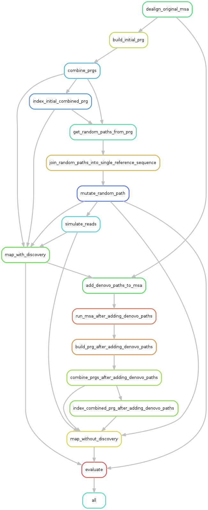

# Pandora Simulations



## Setup initial gene alignment data

The first thing that needs to be done before running the pipeline is to get and organise
the gene alignment data. This is done with a provided script.  

Run the following from the project root directory

```sh
bash scripts/setup_panx_data.sh
```

## Install requirements

### Snakemake

For a basic installation, run:

```sh
pip3 install --user snakemake
```

Other installation options can be found in the [snakemake docs](https://snakemake.readthedocs.io/en/stable/getting_started/installation.html).

### Conda

A basic installation (Linux) that also prevents `conda` from being your default python installation
can be done with:

```sh
wget https://repo.anaconda.com/miniconda/Miniconda3-latest-Linux-x86_64.sh -O miniconda3.sh
conda_prefix=/usr/local/miniconda
sudo bash miniconda3.sh -b -p "$conda_prefix"
# add conda to the end of your path
echo ". ${conda_prefix}/etc/profile.d/conda.sh" >> ~/.bashrc
source "$HOME"/.bashrc
conda activate base
conda config --add channels defaults
conda config --add channels bioconda
conda config --add channels conda-forge
```

For more installation options, see the [conda docs](https://docs.conda.io/projects/conda/en/latest/user-guide/install/index.html#).

### Singularity

Snakemake requires Singularity version **less than** 3.0. For installation of Singularity
see the [docs](https://www.sylabs.io/guides/2.6/user-guide/quick_start.html#quick-installation-steps).

## Run pipeline

From the project root directory, run

```sh
snakemake --use-conda --use-singularity
```
